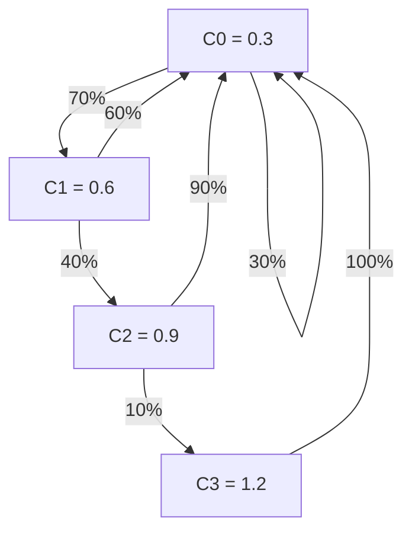

# Pseudo-Random-Distribution

一个简单的、基于马尔科夫链(Markov Chain)的伪随机数分布算法(pseudo-random-distribution)

我想实现的是一个已经在 Dota、LOL 等游戏中实现过的伪随机数分布算法

## 对应的问题

现实中的“随机”可能会出现一些不符合直觉的现象，比如某个游戏里，某个行为掉宝率是 50%，简单计算可知，玩家有约千分之一的机会（准确来说是 1/1024）连续十次出货（或者不出货），这些情况概率不为零，相比于巨大的触发数，这种严重影响用户体验的问题必须予以处理

这里涉及到两方面的考虑：

1. 结果必须是**相对随机**的，不能出现均匀分布的现象，比方说玩家有 25% 暴击率，前 3 次不暴击，那么就预测下一次必定暴击...
2. 不能出现**极端情况**，比如上文提到的高概率连续多次不触发或低概率连续触发

## 已知的实现

目前已知的此类算法是这样的流程：

1. 确定一个初始概率 `C0`
2. 生成一次随机结果，如果成功则回到初始条件 `C0`
3. 如果失败则进入下一个条件 `C1 = C0 * 2`
4. 重复类似第 2 - 3 步的流程，其中 `Cn = C0 * (n + 1)`

比如现在有一个初始概率 `C0 = 0.3`

1. 第一次生成随机数，如果失败进入下一步
2. 第二次生成随机数，此时概率 `C1 = 0.6`，如果失败进入下一步，如果成功回到 `C0`
3. 第三次生成随机数，此时概率 `C2 = 0.9`，如果失败进入下一步，如果成功回到 `C0`
4. 第四次生成随机数，此时概率 `C3 = 1.2`，必定成功，回到 `C0`

此时，根据描述，我们可以简单地绘制一条马尔科夫链：

转移矩阵可能更好理解一些：

$$
P = \begin{pmatrix}
0.3 & 0.7 & 0 & 0 \\
0.6 & 0 & 0.4 & 0 \\
0.9 & 0 & 0 & 0.1 \\
1 & 0 & 0 & 0
\end{pmatrix}
$$

## 初始概率与最终概率的关系

假设最后一步为 `Cm`（也就是 `C0 * (m + 1) >= 1`），我们可以简单得出公式

$$
P = C \times \left(\sum_{n=0}^{m} \left((n+1) \times \prod_{k=1}^{n} (1 - k \times C)\right)\right)
$$

很明显，通过 `C` 解出 `P` 非常简单，但是很难通过 `P` 得到 `C`，至少我无法通过这个公式看出如何反向推导...

根据我查阅到的资料，现有的方案是通过二分查找法，在 `[0, 1]` 中*逼近*真实的 `C` 值

## 算法设计

算法流程设计非常简单：

1. 获取一个 `P`（这个算法只输入一个目标概率）
2. 通过二分查找法获得 `C`
3. 记录当前状态 `C0 = C`
4. 按上述逻辑做状态切换（这个算法只输出一个触发与否；算法内部只需要记住两个值，初始值 `C` 和*当前*状态 `C-now`）

使用 JS 实现一个初步算法：

1. 闭包常量 `C`，闭包变量 `current`
2. 内部方法 `getCFromP` 基于输入的目标概率 `P` 计算 `C`
   1. 其中还需一个 `getRealPFromC` 用于二分查找 `C` 近似值时反向算出对应的实际 `P` 值
   2. 算出 `C` 后需要给 `current` 赋初值
3. 返回方法 `getRandomDistribution`, 调用后输出 `boolean` 指示命中与否，同时变更 `current` 的值

## 限制性

TODO

### 简单优化

TODO

## 参考资料

- [Dota2 的随机分布实现](https://dota2.fandom.com/wiki/Random_Distribution)
